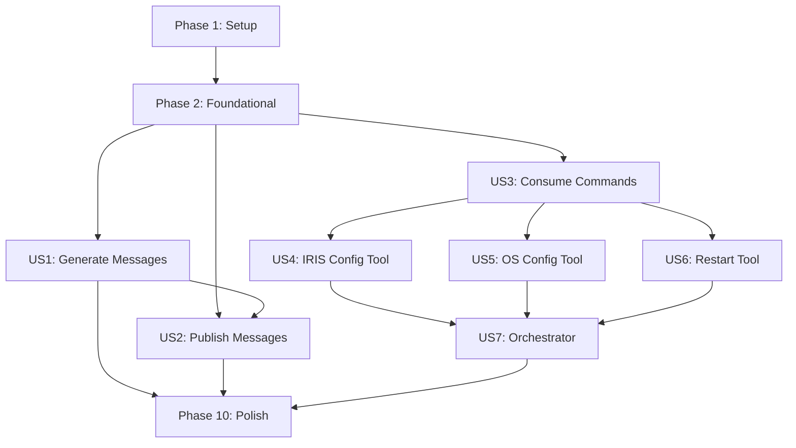

# Tasks: Instance - IRIS Database Emulation & Remediation System

**Feature Branch**: `001-iris-emulation`  
**Input**: Design documents from `specs/001-iris-emulation/`  
**Prerequisites**: plan.md, spec.md, research.md, data-model.md, contracts/, quickstart.md  
**Tests**: Tests are included per constitution requirement (TDD, >=85% coverage, mypy strict)

**Organization**: Tasks are grouped by user story (P1-P7) to enable independent implementation and testing of each story.

## Format: `- [ ] [TaskID] [P?] [Story?] Description`

- **[P]**: Can run in parallel (different files, no dependencies on incomplete tasks)
- **[Story]**: Which user story this task belongs to (US1, US2, US3, US4, US5, US6, US7)
- Include exact file paths in descriptions

---

## Phase 1: Setup (Shared Infrastructure)

**Purpose**: Project initialization and basic structure

- [X] T001 Create project directory structure: src/{agents,tools,models,prompts,cli}, tests/{unit,integration,contract}, log_samples/
- [X] T002 Initialize Python 3.11+ project with pyproject.toml including dependencies: openai, pydantic[email], aiohttp, aiofiles, structlog, psutil, pytest, pytest-asyncio, pytest-cov, mypy
- [X] T003 [P] Configure mypy strict mode in pyproject.toml: strict=true, disallow_untyped_defs=true, warn_return_any=true
- [X] T004 [P] Configure pytest in pyproject.toml: asyncio_mode=auto, testpaths=["tests"], coverage >=85%
- [X] T005 [P] Setup pre-commit hooks for black, isort, mypy in .pre-commit-config.yaml
- [X] T006 [P] Create .env.example with required environment variables: OPENAI_API_KEY, LOG_LEVEL, IRIS_HOME_DIR
- [X] T007 Create README.md with quickstart instructions from specs/001-iris-emulation/quickstart.md

---

## Phase 2: Foundational (Blocking Prerequisites)

**Purpose**: Core infrastructure that MUST be complete before ANY user story can be implemented

**⚠️ CRITICAL**: No user story work can begin until this phase is complete

- [X] T008 Create base exception hierarchy in src/models/exceptions.py: InstanceError, ValidationError, ToolExecutionError, ExternalIntegrationError
- [X] T009 [P] Implement trace ID generation and propagation in src/models/tracing.py using OpenTelemetry format (128-bit hex)
- [X] T010 [P] Configure structlog with JSON formatter in src/models/logging.py: trace_id, timestamp, level, message, context
- [X] T011 [P] Create Pydantic base model with trace_id field in src/models/base.py: BaseModel with trace_id validator
- [X] T012 Implement IRISMessage Pydantic model in src/models/iris_message.py per data-model.md with timestamp/PID/severity/category validators
- [X] T013 [P] Implement RemediationCommand Pydantic model in src/models/remediation_command.py with oneOf parameters validation
- [X] T014 [P] Implement ToolResult Pydantic model in src/models/tool_result.py with ChangeDetail sub-schema
- [X] T015 [P] Implement WorkflowTrace Pydantic model in src/models/workflow_trace.py for orchestration tracking
- [X] T016 [P] Implement MessageGenerationRequest Pydantic model in src/models/message_generation_request.py
- [X] T017 Create MessageTransport protocol in src/models/protocols.py: publish() and consume() async methods
- [X] T018 [P] Implement HTTP transport in src/tools/http_transport.py using aiohttp with retry logic (max 3 attempts, exponential backoff)
- [X] T019 [P] Implement file transport in src/tools/file_transport.py using aiofiles for async I/O
- [X] T020 Create configuration management in src/models/config.py using Pydantic Settings: OpenAI keys, timeouts, IRIS paths
- [X] T021 Setup JSON schema validators in src/models/schema_validators.py for contracts/ JSON schemas (iris_message, remediation_command, tool_response)

**Checkpoint**: Foundation ready - user story implementation can now begin in parallel

---

## Phase 3: User Story 1 - Generate Realistic IRIS Error Messages (Priority: P1) 🎯 MVP

**Goal**: Generate authentic InterSystems IRIS messages.log entries for testing

**Independent Test**: Request message generation for specific error categories (config, license, memory) and validate output format against log_samples/messages.log patterns

### Tests for User Story 1 (Write these tests FIRST, ensure they FAIL)

- [ ] T022 [P] [US1] Create contract test in tests/contract/test_message_generator_contract.py: Verify LLM prompt structure, response parsing, temperature=0.7, few-shot examples from log_samples/
- [ ] T023 [P] [US1] Create integration test in tests/integration/test_message_generation.py: End-to-end message generation for config/license/resource errors, validate against IRIS format regex
- [ ] T024 [P] [US1] Create unit test in tests/unit/test_iris_message_parser.py: Test regex parsing of all category types, edge cases (multi-digit PID, severity 0-3, nested categories)
- [ ] T025 [P] [US1] Create unit test in tests/unit/test_message_generator_agent.py: Mock LLM responses, verify format validation, error handling for malformed LLM output

### Implementation for User Story 1

- [ ] T026 [P] [US1] Implement IRIS message parser in src/models/iris_message_parser.py: Regex pattern `(\d{2}/\d{2}/\d{2}-\d{2}:\d{2}:\d{2}:\d{3})\s+\((\d+)\)\s+(\d)\s+\[([\\w.]+)\]\s+(.*)` with named groups
- [ ] T027 [P] [US1] Create LLM prompt templates in src/prompts/message_generation_prompts.py: System prompt with IRIS format rules, few-shot examples per error category
- [ ] T028 [US1] Implement MessageGeneratorAgent in src/agents/message_generator.py: OpenAI GPT-4 integration (temp 0.7), format validation, trace ID propagation, error handling
- [ ] T029 [US1] Implement message validation logic in src/agents/message_generator.py: Compare generated output against log_samples/messages.log patterns, reject invalid format
- [ ] T030 [US1] Add timestamp generation logic in src/agents/message_generator.py: Sequential timestamps, process ID consistency within session
- [ ] T031 [US1] Add logging for message generation in src/agents/message_generator.py: Log LLM calls, validation results, generation metrics (latency, format match rate)
- [ ] T032 [US1] Create CLI command in src/cli/generate.py: `instance generate --category config --count 10 --severity 2-3 --output json`

**Checkpoint**: User Story 1 complete - Can generate realistic IRIS messages matching reference format

---

## Phase 4: User Story 2 - Publish Messages to External Consumers (Priority: P2)

**Goal**: Send generated IRIS messages to external systems via JSON API

**Independent Test**: Configure external endpoint, generate messages, verify JSON payloads at destination with correct schema and metadata

### Tests for User Story 2 (Write these tests FIRST, ensure they FAIL)

- [ ] T033 [P] [US2] Create contract test in tests/contract/test_message_publisher_contract.py: Validate JSON schema compliance with contracts/iris_message_schema.json, verify ISO 8601 timestamps, trace ID format
- [ ] T034 [P] [US2] Create integration test in tests/integration/test_message_publishing.py: Mock HTTP endpoint, send messages, verify async non-blocking, retry on failure, success logging
- [ ] T035 [P] [US2] Create unit test in tests/unit/test_message_publisher.py: Test async publish with aiohttp mock, exponential backoff calculation, failure queue behavior

### Implementation for User Story 2

- [ ] T036 [P] [US2] Implement MessagePublisher tool in src/tools/message_publisher.py: Async publish method, transport abstraction, JSON serialization from IRISMessage model
- [ ] T037 [US2] Add retry logic to MessagePublisher in src/tools/message_publisher.py: Exponential backoff (1s, 2s, 4s), max 3 attempts, log retry attempts with trace ID
- [ ] T038 [US2] Implement publish event logging in src/tools/message_publisher.py: Log success/failure, endpoint URL, latency, message metadata (severity, category)
- [ ] T039 [US2] Add async batch publishing in src/tools/message_publisher.py: Send multiple messages without blocking, configurable concurrency limit (default 10)
- [ ] T040 [US2] Update CLI command in src/cli/generate.py: Add `--publish` flag to send generated messages to configured endpoint
- [ ] T041 [US2] Add transport configuration in src/models/config.py: HTTP endpoint URL, timeout (default 30s), retry settings

**Checkpoint**: User Stories 1 AND 2 complete - Can generate and publish IRIS messages to external systems

---

## Phase 5: User Story 3 - Consume External Remediation Commands (Priority: P3)

**Goal**: Receive and validate JSON remediation commands from external systems

**Independent Test**: Send valid/invalid JSON commands to intake interface, verify parsing, schema enforcement, error handling

### Tests for User Story 3 (Write these tests FIRST, ensure they FAIL)

- [ ] T042 [P] [US3] Create contract test in tests/contract/test_command_consumer_contract.py: Validate against contracts/remediation_command_schema.json, test all error_type variants (config/license/resource), parameter oneOf validation
- [ ] T043 [P] [US3] Create integration test in tests/integration/test_command_consumption.py: Mock command source, consume commands, verify queue processing, logging with trace ID
- [ ] T044 [P] [US3] Create unit test in tests/unit/test_command_parser.py: Test schema validation errors, malformed JSON handling, requires_restart flag parsing

### Implementation for User Story 3

- [ ] T045 [P] [US3] Implement CommandConsumer tool in src/tools/command_consumer.py: Async consume method using MessageTransport protocol, JSON parsing
- [ ] T046 [US3] Add JSON schema validation in src/tools/command_consumer.py: Validate against contracts/remediation_command_schema.json, return descriptive errors for violations
- [ ] T047 [US3] Implement command intake logging in src/tools/command_consumer.py: Log received commands with trace ID, command_id, error_type, severity, requires_restart flag
- [ ] T048 [US3] Add command queue processing in src/tools/command_consumer.py: Serial processing to avoid conflicting changes, log queue position
- [ ] T049 [US3] Create CLI command in src/cli/consume.py: `instance consume --source http://endpoint --interval 5s` to poll for commands
- [ ] T050 [US3] Add user confirmation for requires_restart=true in src/tools/command_consumer.py: Flag for review before execution, log confirmation request

**Checkpoint**: User Stories 1, 2, AND 3 complete - Bidirectional integration working (publish messages, consume commands)

---

## Phase 6: User Story 4 - Execute IRIS Configuration Changes (Priority: P4)

**Goal**: Modify IRIS CPF settings based on remediation commands

**Independent Test**: Send config change command, verify syntax validation, dry-run capability, actual changes, rollback on failure

### Tests for User Story 4 (Write these tests FIRST, ensure they FAIL)

- [ ] T051 [P] [US4] Create contract test in tests/contract/test_iris_config_tool_contract.py: Validate ToolResult output against contracts/tool_response_schema.json, verify ChangeDetail structure
- [ ] T052 [P] [US4] Create integration test in tests/integration/test_iris_config_execution.py: Mock CPF file, execute config changes, verify diff logging, rollback on failure, dry-run mode
- [ ] T053 [P] [US4] Create unit test in tests/unit/test_iris_config_tool.py: Test CPF parser, parameter validation, invalid parameter rejection, current value mismatch detection

### Implementation for User Story 4

- [ ] T054 [P] [US4] Implement IRISConfigTool in src/tools/iris_config.py: CPF file parsing using configparser, section/parameter validation
- [ ] T055 [US4] Add CPF syntax validation in src/tools/iris_config.py: Check valid sections (config, startup, TCP, SQL), parameter existence, type validation
- [ ] T056 [US4] Implement current value check in src/tools/iris_config.py: Read current CPF value, compare with command.parameters.current_value, abort if mismatch
- [ ] T057 [US4] Add change logging with diff in src/tools/iris_config.py: Log old_value → new_value, section, parameter, timestamp, trace ID
- [ ] T058 [US4] Implement dry-run mode in src/tools/iris_config.py: Validate all changes, return ToolResult with would-be changes, don't modify CPF
- [ ] T059 [US4] Add rollback capability in src/tools/iris_config.py: Backup CPF before changes, restore on failure, log rollback action
- [ ] T060 [US4] Implement 60s timeout enforcement in src/tools/iris_config.py: Use asyncio.wait_for(), return timeout error in ToolResult
- [ ] T061 [US4] Create tool agent wrapper in src/agents/tool_agents.py: IRISConfigAgent that invokes IRISConfigTool, handles exceptions, returns ToolResult

**Checkpoint**: User Story 4 complete - Can execute IRIS configuration changes with validation and rollback

---

## Phase 7: User Story 5 - Execute OS-Level Reconfigurations (Priority: P5)

**Goal**: Adjust kernel parameters for IRIS optimization

**Independent Test**: Send OS reconfiguration command in test environment, verify current value checks, change logging, permission error handling

### Tests for User Story 5 (Write these tests FIRST, ensure they FAIL)

- [ ] T062 [P] [US5] Create contract test in tests/contract/test_os_config_tool_contract.py: Validate ToolResult structure, verify parameter diff format, error_message for permission failures
- [ ] T063 [P] [US5] Create integration test in tests/integration/test_os_config_execution.py: Mock /proc/sys/ and sysctl, execute changes, verify validation, rollback on error
- [ ] T064 [P] [US5] Create unit test in tests/unit/test_os_config_tool.py: Test kernel parameter parsing, min/max validation, permission error detection, dangerous change warnings

### Implementation for User Story 5

- [ ] T065 [P] [US5] Implement OSConfigTool in src/tools/os_config.py: Read kernel parameters from /proc/sys/, use sysctl for changes
- [ ] T066 [US5] Add current parameter value check in src/tools/os_config.py: Read current value before change, log diff (old vs new)
- [ ] T067 [US5] Implement parameter validation in src/tools/os_config.py: Check min_value/max_value from command, warn if below IRIS minimum requirements
- [ ] T068 [US5] Add permission check in src/tools/os_config.py: Detect permission errors, return error with instructions for required privileges (root or CAP_SYS_ADMIN)
- [ ] T069 [US5] Implement change verification in src/tools/os_config.py: Read back parameter after change, confirm new value matches expected
- [ ] T070 [US5] Add dangerous change warnings in src/tools/os_config.py: Flag changes reducing memory below IRIS requirements, require explicit confirmation
- [ ] T071 [US5] Implement dry-run mode in src/tools/os_config.py: Validate parameters, return would-be changes without applying
- [ ] T072 [US5] Create tool agent wrapper in src/agents/tool_agents.py: OSConfigAgent that invokes OSConfigTool, handles permission errors, returns ToolResult

**Checkpoint**: User Story 5 complete - Can execute OS-level reconfigurations with safety checks

---

## Phase 8: User Story 6 - Execute IRIS Instance Restarts (Priority: P6)

**Goal**: Gracefully restart IRIS instance with active user checks

**Independent Test**: Trigger restart in dev environment, verify active user detection, graceful shutdown, startup validation, health checks

### Tests for User Story 6 (Write these tests FIRST, ensure they FAIL)

- [ ] T073 [P] [US6] Create contract test in tests/contract/test_iris_restart_tool_contract.py: Validate ToolResult for restart operations, verify requires_user_action flag when active users detected
- [ ] T074 [P] [US6] Create integration test in tests/integration/test_iris_restart_execution.py: Mock IRIS process and psutil, simulate active users, test graceful shutdown, startup validation
- [ ] T075 [P] [US6] Create unit test in tests/unit/test_iris_restart_tool.py: Test active user detection logic, timeout handling, startup health checks, failure scenarios

### Implementation for User Story 6

- [ ] T076 [P] [US6] Implement IRISRestartTool in src/tools/iris_restart.py: Use psutil to detect IRIS processes, check for active connections
- [ ] T077 [US6] Add active user detection in src/tools/iris_restart.py: Check for active user sessions and transactions, configurable timeout (default 60s)
- [ ] T078 [US6] Implement graceful shutdown in src/tools/iris_restart.py: Send SIGTERM, wait for process termination, timeout after configurable seconds (default 120s)
- [ ] T079 [US6] Add shutdown failure handling in src/tools/iris_restart.py: Log failure, do NOT attempt startup, return ToolResult with error_message and status=failure
- [ ] T080 [US6] Implement IRIS startup in src/tools/iris_restart.py: Start IRIS daemon, wait for process to appear, configurable startup timeout (default 60s)
- [ ] T081 [US6] Add startup health checks in src/tools/iris_restart.py: Verify IRIS is accepting connections, key services running, return success only after validation
- [ ] T082 [US6] Implement configurable timeouts in src/tools/iris_restart.py: User wait timeout, shutdown timeout, startup timeout from config or command parameters
- [ ] T083 [US6] Create tool agent wrapper in src/agents/tool_agents.py: IRISRestartAgent that invokes IRISRestartTool, handles active user warnings, returns ToolResult

**Checkpoint**: User Story 6 complete - Can safely restart IRIS instances with user protection

---

## Phase 9: User Story 7 - Orchestrate Multi-Step Remediation Workflows (Priority: P7)

**Goal**: Coordinate complex remediation scenarios requiring multiple tools in sequence

**Independent Test**: Send command requiring multiple steps (config change + restart), verify correct tool invocation order, mid-workflow failure handling, end-to-end completion

### Tests for User Story 7 (Write these tests FIRST, ensure they FAIL)

- [ ] T084 [P] [US7] Create contract test in tests/contract/test_orchestrator_contract.py: Validate WorkflowTrace structure, verify steps_executed array contains all ToolResults in order
- [ ] T085 [P] [US7] Create integration test in tests/integration/test_orchestration_workflows.py: Test config+restart workflow, verify execution order, test abort on first failure, test aggregate status
- [ ] T086 [P] [US7] Create unit test in tests/unit/test_remediation_orchestrator.py: Test workflow planning, tool invocation order, failure abort logic, trace creation

### Implementation for User Story 7

- [ ] T087 [P] [US7] Implement RemediationOrchestrator in src/agents/remediation_orchestrator.py: Parse command.execution_order, invoke tools sequentially
- [ ] T088 [US7] Add tool invocation sequencing in src/agents/remediation_orchestrator.py: Execute tools in specified order, pass command to each tool agent
- [ ] T089 [US7] Implement validation between steps in src/agents/remediation_orchestrator.py: Check ToolResult.status after each tool, abort if status=failure or partial
- [ ] T090 [US7] Add workflow trace creation in src/agents/remediation_orchestrator.py: Build WorkflowTrace with trace_id, steps_executed (array of ToolResults), overall_status
- [ ] T091 [US7] Implement failure handling in src/agents/remediation_orchestrator.py: Log failure point, abort remaining steps, don't execute subsequent tools, return error WorkflowTrace
- [ ] T092 [US7] Add aggregate status calculation in src/agents/remediation_orchestrator.py: overall_status=success only if all tools succeeded, failure if any failed, partial if mixed
- [ ] T093 [US7] Implement workflow logging in src/agents/remediation_orchestrator.py: Log workflow start, each tool execution, results, overall completion with trace ID
- [ ] T094 [US7] Create CLI command in src/cli/orchestrate.py: `instance orchestrate --command-file command.json` to execute multi-step workflows

**Checkpoint**: User Story 7 complete - All functionality implemented, system can orchestrate complex remediation workflows

---

## Phase 10: Polish & Cross-Cutting Concerns

**Purpose**: Improvements that affect multiple user stories

- [ ] T095 [P] Add comprehensive docstrings to all modules following Google style guide
- [ ] T096 [P] Update README.md with architecture diagrams (agents, tools, data flow)
- [ ] T097 [P] Create API documentation in docs/api.md: All Pydantic models, tool signatures, agent interfaces
- [ ] T098 [P] Add performance profiling in src/cli/profile.py: Measure message generation latency, tool execution time, end-to-end workflow duration
- [ ] T099 [P] Implement PII redaction in src/models/logging.py: Redact passwords, license keys, API keys from all log output per FR-024
- [ ] T100 [P] Add security hardening: Validate all file paths to prevent traversal, sanitize command parameters, rate limit external API calls
- [ ] T101 [P] Create example commands in examples/ directory: Sample RemediationCommand JSON files for each error type, example message generation requests
- [ ] T102 [P] Add metrics collection in src/models/metrics.py: Track message generation rate, tool success/failure rates, workflow completion time
- [ ] T103 Run full test suite: pytest --cov=src --cov-report=term-missing --cov-fail-under=85
- [ ] T104 Run mypy strict type checking: mypy src/ --strict
- [ ] T105 Validate against quickstart.md: Execute all commands from specs/001-iris-emulation/quickstart.md, verify expected behavior
- [ ] T106 Create deployment guide in docs/deployment.md: Production configuration, environment variables, monitoring setup, troubleshooting

---

## Dependencies & Execution Order

### Phase Dependencies

- **Phase 1 (Setup)**: No dependencies - can start immediately
- **Phase 2 (Foundational)**: Depends on Phase 1 completion - BLOCKS all user stories
- **Phase 3 (US1)**: Depends on Phase 2 completion - No dependencies on other user stories
- **Phase 4 (US2)**: Depends on Phase 2 completion - Integrates with US1 (uses IRISMessage model) but independently testable
- **Phase 5 (US3)**: Depends on Phase 2 completion - No dependencies on other user stories
- **Phase 6 (US4)**: Depends on Phase 2 and Phase 5 completion (needs RemediationCommand from US3)
- **Phase 7 (US5)**: Depends on Phase 2 and Phase 5 completion (needs RemediationCommand from US3)
- **Phase 8 (US6)**: Depends on Phase 2 and Phase 5 completion (needs RemediationCommand from US3)
- **Phase 9 (US7)**: Depends on Phase 2, 5, 6, 7, 8 completion (orchestrates all tools from US4-US6)
- **Phase 10 (Polish)**: Depends on completion of all desired user stories

### User Story Dependencies



- **US1 (P1)**: Foundation only - Independently generates messages
- **US2 (P2)**: Foundation + US1 (uses IRISMessage model)
- **US3 (P3)**: Foundation only - Independently consumes commands
- **US4 (P4)**: Foundation + US3 (needs RemediationCommand)
- **US5 (P5)**: Foundation + US3 (needs RemediationCommand)
- **US6 (P6)**: Foundation + US3 (needs RemediationCommand)
- **US7 (P7)**: Foundation + US3 + US4 + US5 + US6 (orchestrates all tools)

### Within Each User Story

1. **Tests FIRST**: Write all contract/integration/unit tests, ensure they FAIL
2. **Models**: Implement Pydantic entities needed for the story
3. **Core Logic**: Implement agents/tools
4. **Integration**: Wire up components, add logging, error handling
5. **CLI**: Add command-line interface for the story's functionality
6. **Validation**: Run tests, verify all pass, check coverage >=85%

### Parallel Opportunities

**Phase 1 (Setup)**: All tasks marked [P] can run in parallel (T003, T004, T005, T006)

**Phase 2 (Foundational)**: 
- Parallel group 1: T009 (tracing), T010 (logging), T011 (base model)
- Parallel group 2: T012-T016 (all Pydantic models)
- Parallel group 3: T018 (HTTP transport), T019 (file transport)

**Phase 3 (US1)**: 
- All tests (T022-T025) can run in parallel
- Implementation: T026 (parser) and T027 (prompts) can run in parallel, then T028-T032 sequentially

**Phase 4 (US2)**:
- All tests (T033-T035) can run in parallel
- Implementation: T036 (publisher) first, then T037-T041 can run in parallel

**Phase 5 (US3)**:
- All tests (T042-T044) can run in parallel
- Implementation: T045-T046 first (consumer + validation), then T047-T050 can run in parallel

**Phase 6 (US4)**:
- All tests (T051-T053) can run in parallel
- Implementation: T054-T055 first (tool + validation), then T056-T061 can run in parallel (different features)

**Phase 7 (US5)**:
- All tests (T062-T064) can run in parallel
- Implementation: T065-T066 first (tool + value check), then T067-T072 can run in parallel

**Phase 8 (US6)**:
- All tests (T073-T075) can run in parallel
- Implementation: T076-T077 first (tool + user detection), then T078-T083 can run in parallel

**Phase 9 (US7)**:
- All tests (T084-T086) can run in parallel
- Implementation: T087 first (orchestrator skeleton), then T088-T094 can be parallelized in groups

**Phase 10 (Polish)**:
- All documentation tasks (T095-T097, T101, T106) can run in parallel
- All utility tasks (T098-T100, T102) can run in parallel
- Validation tasks (T103-T105) must run sequentially after all implementation complete

### Cross-Phase Parallelism

Once Phase 2 (Foundational) is complete, these user stories can be worked on in parallel by different team members:

- **Track 1**: US1 → US2 (Message generation and publishing)
- **Track 2**: US3 → US4 → US5 → US6 (Command consumption and tool implementation)
- **Track 3**: US7 (Can start after US3-US6 complete for integration)

This enables 2-3 developers to work simultaneously without blocking each other.

---

## Parallel Example: Foundational Phase

```bash
# Start all model definitions in parallel (no dependencies)
git checkout -b foundation-models
# Developer 1:
git checkout -b dev1-pydantic-models
# Implement T012 (IRISMessage), T013 (RemediationCommand), T014 (ToolResult)

# Developer 2:
git checkout -b dev2-pydantic-models  
# Implement T015 (WorkflowTrace), T016 (MessageGenerationRequest)

# Developer 3:
git checkout -b dev3-infrastructure
# Implement T009 (tracing), T010 (logging), T017 (protocols)

# All merge to foundation-models when complete
```

---

## Parallel Example: User Story 1 (Message Generation)

```bash
# After Foundation phase complete
git checkout -b us1-message-generation

# Developer 1: Tests
git checkout -b us1-tests
# Implement T022, T023, T024, T025 (all tests in parallel)

# Developer 2: Parser + Prompts
git checkout -b us1-parser
# Implement T026 (parser) and T027 (prompts) in parallel

# Developer 3: Agent
git checkout -b us1-agent
# Implement T028-T032 (agent, validation, CLI)

# All merge to us1-message-generation, tests should pass
```

---

## Implementation Strategy

### MVP Scope (Recommended for Initial Release)

**User Story 1 only**: Generate realistic IRIS messages
- Tasks: T001-T032 (Setup → Foundational → US1)
- Deliverable: Working message generator validated against log_samples/
- Value: Enables immediate testing of IRIS systems with realistic test data
- Estimated effort: ~3-4 weeks for single developer

### Incremental Delivery Plan

1. **Iteration 1 (MVP)**: US1 - Message generation
2. **Iteration 2**: US2 + US3 - Bidirectional integration (publish + consume)
3. **Iteration 3**: US4 + US5 + US6 - All remediation tools
4. **Iteration 4**: US7 - Multi-step orchestration
5. **Iteration 5**: Polish and productionization

Each iteration delivers independently testable, usable functionality.

---

## Task Validation Summary

- **Total Tasks**: 106
- **Tasks per User Story**:
  - Setup: 7 tasks
  - Foundational: 14 tasks (BLOCKING)
  - US1 (P1): 11 tasks (MVP)
  - US2 (P2): 9 tasks
  - US3 (P3): 9 tasks
  - US4 (P4): 11 tasks
  - US5 (P5): 11 tasks
  - US6 (P6): 11 tasks
  - US7 (P7): 11 tasks
  - Polish: 12 tasks

- **Format Validation**: ✅ All tasks follow `- [ ] [TaskID] [P?] [Story?] Description with file path` format
- **Checklist Format**: ✅ All tasks use markdown checkbox syntax `- [ ]`
- **Task IDs**: ✅ Sequential T001-T106 in execution order
- **Parallel Markers**: ✅ 47 tasks marked [P] for parallelization
- **Story Labels**: ✅ All user story tasks labeled [US1]-[US7]
- **File Paths**: ✅ All implementation tasks include specific file paths
- **Independent Tests**: ✅ Each user story has clear test criteria
- **Test Coverage**: ✅ Constitution-compliant TDD approach (tests before implementation)

---

## Notes

- **Constitution Compliance**: All tasks follow TDD (tests first), mypy strict mode, >=85% coverage requirement, trace ID propagation
- **IRIS-Specific**: Tasks enforce message format validation (FR-001), tool safety (FR-009/011/013), dry-run mode (FR-017), rollback (FR-016)
- **Performance**: Tasks target <500ms message generation (SC-002), <200ms tool validation (SC-006), 50 concurrent ops (SC-010)
- **External Integration**: Tasks implement async non-blocking I/O (FR-006), retry with backoff (FR-023), schema validation (FR-008)
- **Observability**: All tasks include trace ID propagation (FR-021), structured JSON logging (FR-022), PII redaction (FR-024)
